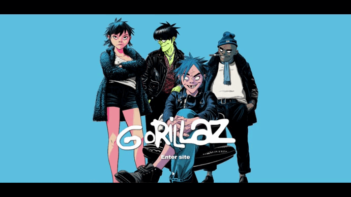

# Gorillaz Web Site

## Descripción
Sitio web de la banda Gorillaz realizado en HTML y PHP con base a la metodología BEM y las herramientas de SASS.  

## Tecnologias
* [PHP](https://www.php.net/docs.php)
* [HTML](https://www.w3schools.com/html/default.asp)
* [CSS](https://www.w3schools.com/css/default.asp)
* [SASS](https://sass-lang.com/)

## Set Up Instructions For Running Website
- Start the Apache using the **XAMPP** controller.
- Open the htdocs folder in the xampp folder. Copy paste the folder **GorillazWebSite-master**.
- Open the browser (chrome), type *localhost/GorillazWebSite-master* and you should see the index page of the website.

## Autor 
Jonatan Ruben
* [Linkedin](https://www.linkedin.com/in/medinajonatan45/)
* [Portafolio](https://medinajonatan45.github.io/MyPortfolio/)

## Contratación
* Puedes escribirme a medinaarcos.jonatanruben@gmail.com