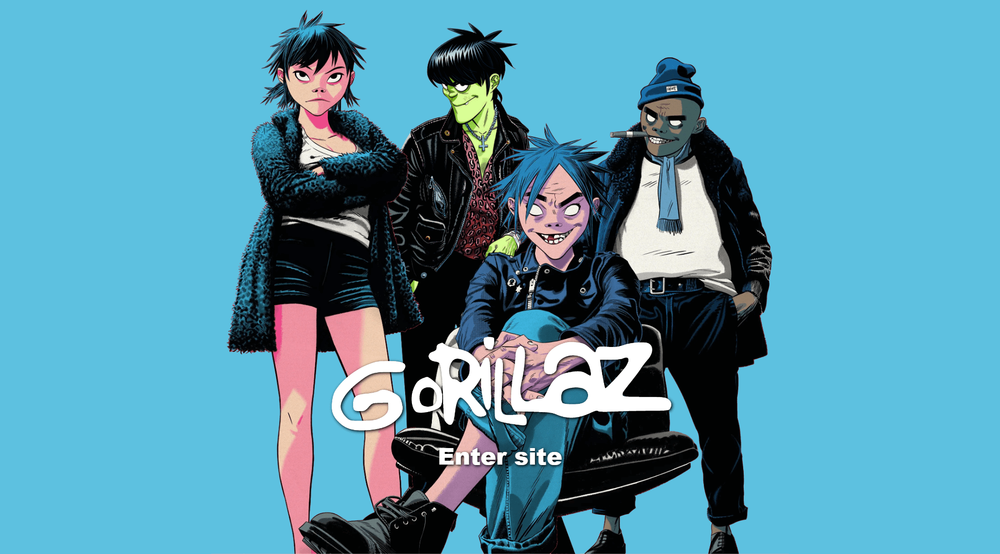

# Gorillaz Web Site

## Descripción
Sitio web de la banda Gorillaz realizado en HTML y PHP con base a la metodología BEM y las herramientas de SASS.  
* [Ver en vivo](https://medinajonatan45.github.io/GorillazWebSite/)
## Autor 
Jonatan Ruben
* [Linkedin](https://www.linkedin.com/in/medinajonatan45/)
* [Portafolio](https://medinajonatan45.github.io/MyPortfolio/)

## Contratación
* Puedes escribirme a medinaarcos.jonatanruben@gmail.com